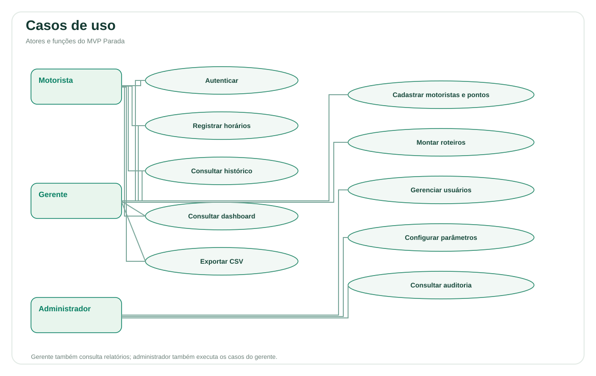
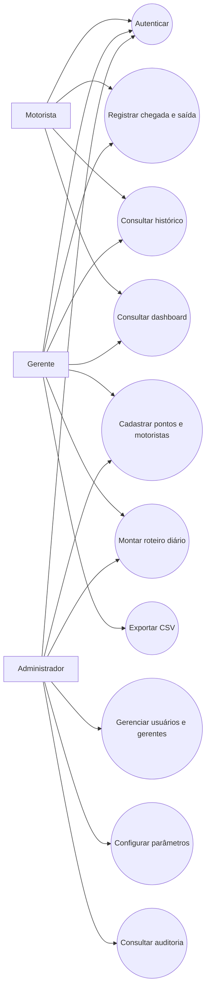
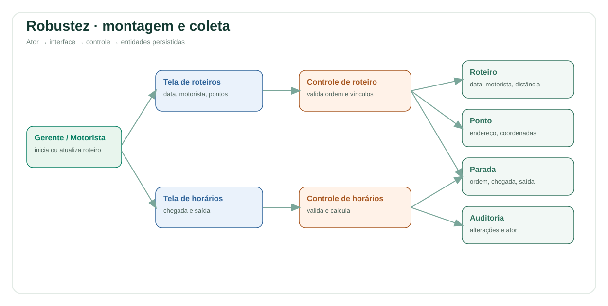
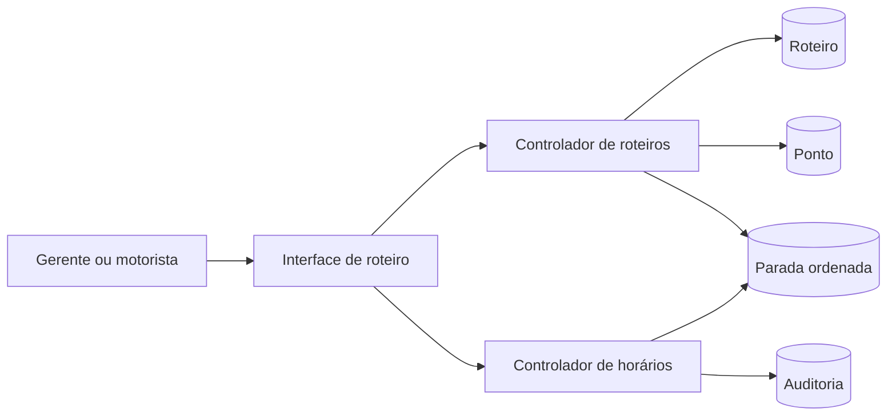
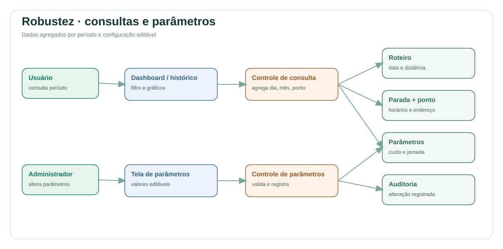
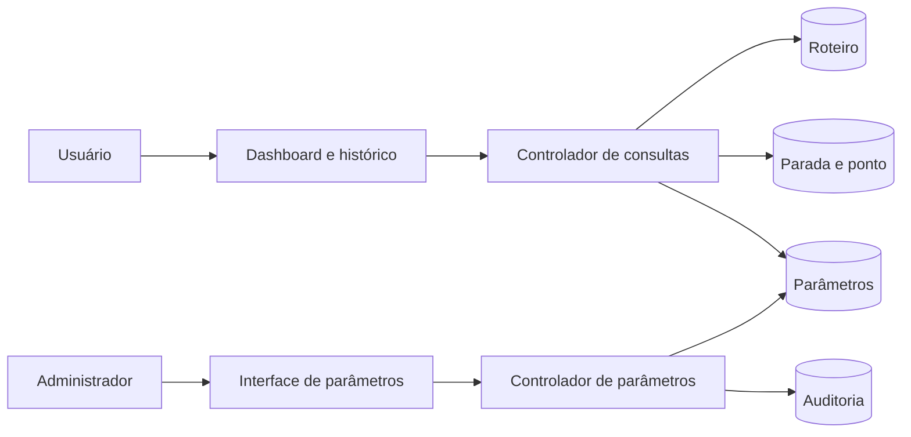
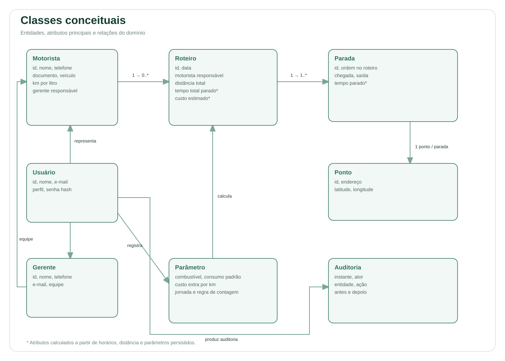
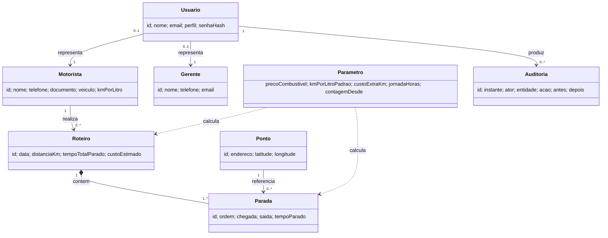

# Projeto preliminar — Parada

**Produto:** Parada — inteligência em cada rota.  
**Objetivo:** registrar o tempo parado de profissionais em pontos de roteiros diários e mostrar o efeito no tempo e no custo da operação.

## Diagramas prontos para abrir

- [Todos os diagramas em um PDF](diagramas/diagramas-completos.pdf)
- [Casos de uso em PDF](diagramas/casos-de-uso.pdf)
- [Robustez — montagem e coleta em PDF](diagramas/robustez-roteiro.pdf)
- [Robustez — consultas e parâmetros em PDF](diagramas/robustez-consultas.pdf)
- [Classes conceituais em PDF](diagramas/classes-conceituais.pdf)

Versões vetoriais SVG:

- [Casos de uso](diagramas/casos-de-uso.svg)
- [Robustez — montagem e coleta](diagramas/robustez-roteiro.svg)
- [Robustez — consultas e parâmetros](diagramas/robustez-consultas.svg)
- [Classes conceituais](diagramas/classes-conceituais.svg)

Os arquivos SVG podem ser abertos diretamente no navegador. Os blocos Mermaid abaixo preservam a versão textual editável.

## Atores e casos de uso

| Ator | Casos de uso |
| --- | --- |
| Motorista/motoboy | Entrar no sistema; consultar seus roteiros; registrar chegada e saída; consultar seu histórico e painel; exportar CSV. |
| Gerente/coordenador | Entrar no sistema; cadastrar motoristas e pontos; montar roteiros; alterar distância; registrar ou corrigir horários; consultar painel, histórico e exportação. |
| Administrador | Executar os casos do gerente; cadastrar gerentes e usuários; alterar parâmetros; consultar auditoria. |

## Regras e fluxos principais

**UC01 — Montar roteiro.** Gerente escolhe data e motorista, informa distância e adiciona pontos sequencialmente. O primeiro ponto é a partida. O sistema guarda roteiro e ordem. Pré-condições: motorista e pontos cadastrados. Pós-condição: roteiro persistido para um motorista e uma data.

**UC02 — Coletar horários.** Usuário autorizado escolhe um ponto do roteiro e registra chegada e saída. A saída exige chegada e não pode precedê-la. A chegada deve estar na data do roteiro. O sistema calcula a diferença em segundos; a partida não acumula tempo. Correções ficam na auditoria com valores anterior e novo.

**UC03 — Consultar painel e histórico.** Usuário seleciona início e fim de um período de até 12 meses. O sistema agrega segundos por dia, mês e endereço, mostra o tempo total e os roteiros correspondentes. O histórico inclui endereço, chegada, saída e tempo por parada. Motorista recebe apenas seus roteiros.

**UC04 — Calcular custo.** Ao consultar um roteiro, o sistema usa o consumo do motorista quando cadastrado; caso contrário, o consumo padrão. Calcula o custo por km com combustível mais adicional e multiplica pela distância informada. Mudanças de parâmetros recalculam o valor exibido.

**UC05 — Administrar parâmetros.** Administrador altera preço do combustível, consumo padrão, custo extra/km, jornada e posição inicial de contagem. A posição mínima é 2, preservando a regra de que a partida não conta.

## Diagramas de robustez

### Montagem e coleta do roteiro

### Consulta e parâmetros

## Classes conceituais

**Persistência:** SQLite com chaves estrangeiras, ordem única por roteiro e índices para consulta por data. `Parada` representa a associação entre roteiro e ponto e guarda horários. Os valores calculados são derivados na consulta, preservando o dado original.

**Acesso e dados pessoais:** autenticação por senha com PBKDF2 e salt, sessão em cookie `HttpOnly` e `SameSite=Strict`, autorização por perfil e restrição dos roteiros para motoristas e da equipe para gerentes. O sistema guarda os dados necessários aos cadastros e à operação. Para implantação real, ainda são necessárias definições organizacionais de base legal, retenção, atendimento aos titulares, backup e HTTPS.

## Rastreabilidade dos critérios de aceitação

| Critério | Implementação |
| --- | --- |
| Ponto de partida sem tempo | Cálculo usa somente posições a partir de 2; o parâmetro tem mínimo 2. |
| Painel por dia, mês e período | Filtros e gráficos na Visão geral; agregações diárias e mensais da API. |
| Tempo ligado a endereço e horários | Parada referencia ponto e guarda chegada/saída; histórico mostra os três campos. |
| Parâmetros sem mudança no código | Valores na tabela `settings`, editáveis por administrador. |

## Nome e campanha

**Nome:** Parada. Curto, memorável e diretamente ligado à medida que a operação ainda não enxerga.

**Mensagem:** “Cada minuto parado conta. Descubra onde sua rota perde tempo.”

**Peça para divulgação:** um cartão digital com o título “Sua rota tem pontos cegos?”, gráfico simples de minutos por endereço e chamada “Veja o tempo de cada parada. Planeje com dados. Conheça o Parada.” Público: transportadoras e equipes de entregas urbanas.
